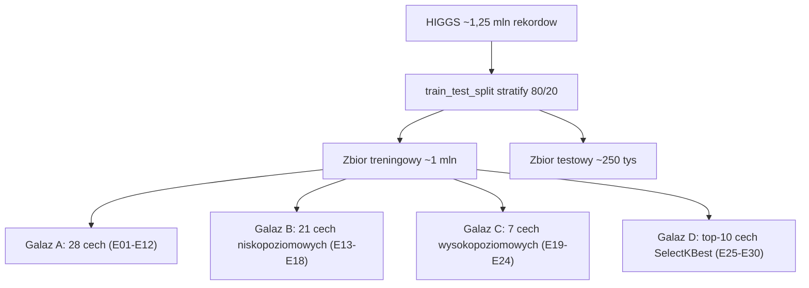

# Plan realizacji projektu: klasyfikacja HIGGS (scikit-learn)

Dokument planistyczny dla zespolu studenckiego (Computer Science). Opisuje, **jak** zrealizowac projekt z analizy danych na zbiorze **HIGGS**, zgodnie z wymaganiami prowadzacego.

Cel: projekt profesjonalny, ale prosty, spelniajacy wszystkie wymagania i wykonalny w jednym notebooku Jupyter w rozsadnym czasie.

> Ten plik to **plan**, a nie implementacja. Nie zawiera kodu, notebooka ani gotowego raportu. Notebook `higgs_analiza.ipynb` oraz raport tworzy zespol na podstawie tego planu.

---

## Kluczowe zalozenia (decyzje projektowe)

- Wczytujemy **~1,25 mln rekordow** przez parametr `nrows` (zamiast calego pliku 11 mln / ~8 GB). Podzial `train_test_split` 80/20 ze stratyfikacja daje **~1 000 000 rekordow treningowych** (spelnia wymog min. 1 mln) i **~250 000 testowych**.
- Dane HIGGS trzeba **pobrac** (UCI Machine Learning Repository, plik `HIGGS.csv.gz`). Plik jest bez naglowka: kolumna 0 = etykieta klasy, kolumny 1-28 = cechy. Brak brakow danych, wszystkie cechy numeryczne.
- Struktura cech HIGGS idealnie mapuje sie na wymagane galezie: **21 cech niskopoziomowych** (kinematyka) + **7 cech wysokopoziomowych** (pochodne, wyliczone przez fizykow) = 28.
- **4 galezie** eksperymentow (wymagane min. 3) na roznych zestawach kolumn -> dokladnie **30 eksperymentow**.
- Modele: wylacznie **klasyczne i szybkie** dla 1 mln rekordow. `HistGradientBoostingClassifier` to natywny komponent scikit-learn (nie zewnetrzny framework) i pelni role glownego "mocnego" modelu.
- Feature selection: **jedna prosta metoda** - `SelectKBest(f_classif)`.
- Reprodukowalnosc: staly `random_state = 42` wszedzie, zapisane wersje bibliotek, udokumentowany `nrows` i sposob podzialu danych.

---

## 1. Struktura projektu

Katalog `projekt/` wewnatrz repozytorium `PSiO_PS/`:

```
projekt/
├── README.md                      # opis, instrukcja pobrania danych, wersje bibliotek, reprodukcja
├── requirements.txt               # zaleznosci (wersje bibliotek)
├── .gitignore                     # ignoruje duzy plik danych w data/
├── PLAN_PROJEKTU.md               # ten plan
├── data/                          # miejsce na HIGGS.csv.gz (NIE commitowac)
│   └── .gitkeep
├── higgs_analiza.ipynb            # GLOWNY notebook (analiza + 30 eksperymentow) - tworzy zespol
├── wyniki/
│   ├── wyniki_eksperymentow.csv   # tabela wynikow generowana przez notebook
│   └── wykresy/                   # zapisane wykresy PNG do raportu
│       └── .gitkeep
└── dokumentacja/
    └── raport.pdf                 # raport koncowy oddawany na CEZ
```

### Struktura notebooka (sekcje)

- **S0. Strona tytulowa** - temat, autorzy, grupa, data, krotki opis HIGGS, informacja o reprodukcji (seed).
- **S1. Import bibliotek** - oraz ustawienie `RANDOM_STATE = 42`.
- **S2. Wczytanie danych** - `read_csv` z `nrows`, `dtype=float32`, recznie nadane nazwy kolumn.
- **S3. Analiza zbioru (EDA)**.
- **S4. Preprocessing** - definicja X/y, podzial train/test, standaryzacja w pipeline dla modeli liniowych, definicja zestawow cech A/B/C/D.
- **S5. Feature selection** - `SelectKBest(f_classif)`, ranking cech, wybor top-10.
- **S6. Funkcja pomocnicza** `trenuj_i_ocen(...)` - zwraca metryki + czas treningu (klucz do czystego kodu: jedna funkcja wywolana 30 razy).
- **S7-S10. Eksperymenty** galezi A, B, C, D.
- **S11. Zbiorcza tabela wynikow** + wykresy porownawcze.
- **S12. Macierze pomylek** dla najlepszych modeli.
- **S13. Obserwacje** (interpretacja roznic).
- **S14. Wnioski koncowe**.
- **S15. Bibliografia / zrodlo danych**.

---

## 2. Analiza zbioru danych (EDA)

**Co policzyc:**
- Liczba rekordow i cech (`shape`), typy cech (`dtypes` - wszystkie numeryczne).
- Sprawdzenie brakow danych (`isnull().sum()` - w HIGGS = 0).
- Statystyki opisowe (`describe()`): srednia, odchylenie standardowe, min/max, kwartyle.
- Balans klas (`value_counts(normalize=True)`) - HIGGS jest **niemal zbalansowany** (~53% sygnal / ~47% tlo). To uzasadnia sensownosc metryki accuracy.
- Korelacje miedzy cechami (`corr()`) - wykrycie redundancji (zwlaszcza miedzy cechami wysokopoziomowymi a niskopoziomowymi).

**Wykresy:**
- Rozklad klas (bar / countplot) - **obowiazkowy**, pokazuje (nie)zbalansowanie.
- Heatmapa korelacji 28 cech - **obowiazkowa**.
- Histogramy wybranych cech (**warto**: z podzialem na klasy, by pokazac separowalnosc).

**Do raportu:** rozmiar zbioru, liczba i rodzaj cech (21 niskopoziomowych + 7 wysokopoziomowych), poziom zbalansowania, brak brakow danych, wnioski z analizy korelacji.

---

## 3. Preprocessing

- **Normalizacja (min-max): NIE** jest potrzebna.
- **Standaryzacja (`StandardScaler`): TAK**, ale **tylko dla modeli liniowych** (`LogisticRegression`, `SGDClassifier`), poniewaz sa wrazliwe na skale cech. Realizujemy przez `Pipeline(StandardScaler, model)` - scaler uczony **tylko na zbiorze treningowym** (brak wycieku danych). Modele drzewiaste (DecisionTree, RandomForest, HistGradientBoosting) **NIE wymagaja** skalowania.
- **Usuwanie kolumn:** w wariancie bazowym nie usuwamy nic (brak kolumny ID, brak kolumn stalych, brak brakow). "Ograniczanie kolumn" realizujemy celowo przez **galezie cech (A/B/C/D)** i **feature selection**.
- **Przygotowanie danych:** nadanie nazw kolumnom, `dtype=float32` (oszczednosc RAM ~2x), `X = kolumny 1-28`, `y = kolumna 0`, `train_test_split(test_size=0.2, stratify=y, random_state=42)`.

---

## 4. Feature Selection

- **Metoda:** `SelectKBest(score_func=f_classif, k=10)` - jednowymiarowy test ANOVA F.
- **Dlaczego ta metoda:** najprostsza i najszybsza w scikit-learn, nie wymaga trenowania modelu, jest **deterministyczna** (latwa reprodukcja), a jej wynik (ranking F-score) latwo zinterpretowac i zwizualizowac. Idealna dla 1 mln rekordow i poziomu studenckiego.
- **Wykorzystanie:** ranking cech -> wykres slupkowy waznosci -> wybor **top-10** cech do galezi D. Opcjonalny sanity-check: porownanie z `feature_importances_` z RandomForest (model i tak trenowany w galezi A).

---

## 5. Eksperymenty (dokladnie 30, w 4 galeziach)

Schemat galezi:



Dla **kazdego** eksperymentu zapisujemy **ten sam zestaw metryk** (na zbiorze testowym): accuracy, precision, recall, F1-score, macierz pomylek oraz czas treningu. Klasa pozytywna = 1 (sygnal). Wyniki trafiaja do jednego `DataFrame` -> `wyniki/wyniki_eksperymentow.csv`.

### Galaz A - pelny zestaw 28 cech (12 eksperymentow; glowne badanie hiperparametrow)

| Nr | Model | Zmieniane parametry |
|----|-------|---------------------|
| E01 | LogisticRegression | C = 0.01 |
| E02 | LogisticRegression | C = 1 (baseline) |
| E03 | LogisticRegression | C = 100 |
| E04 | SGDClassifier | loss = log_loss |
| E05 | SGDClassifier | loss = hinge |
| E06 | DecisionTree | max_depth = 5 |
| E07 | DecisionTree | max_depth = 15 |
| E08 | DecisionTree | max_depth = None |
| E09 | RandomForest | n_estimators = 100, max_depth = 10 |
| E10 | RandomForest | n_estimators = 200, max_depth = 20 |
| E11 | HistGradientBoosting | parametry domyslne |
| E12 | HistGradientBoosting | learning_rate = 0.2, max_iter = 300 |

### Galaz B - 21 cech niskopoziomowych (6 eksperymentow; te same 6 konfiguracji modeli)

| Nr | Model | Parametry |
|----|-------|-----------|
| E13 | LogisticRegression | C = 1 |
| E14 | SGDClassifier | loss = log_loss |
| E15 | DecisionTree | max_depth = 15 |
| E16 | RandomForest | n_estimators = 100, max_depth = 10 |
| E17 | RandomForest | n_estimators = 200, max_depth = 20 |
| E18 | HistGradientBoosting | domyslne |

### Galaz C - 7 cech wysokopoziomowych (6 eksperymentow; te same konfiguracje)

| Nr | Model | Parametry |
|----|-------|-----------|
| E19 | LogisticRegression | C = 1 |
| E20 | SGDClassifier | loss = log_loss |
| E21 | DecisionTree | max_depth = 15 |
| E22 | RandomForest | n_estimators = 100, max_depth = 10 |
| E23 | RandomForest | n_estimators = 200, max_depth = 20 |
| E24 | HistGradientBoosting | domyslne |

### Galaz D - top-10 cech z SelectKBest (6 eksperymentow; te same konfiguracje)

| Nr | Model | Parametry |
|----|-------|-----------|
| E25 | LogisticRegression | C = 1 |
| E26 | SGDClassifier | loss = log_loss |
| E27 | DecisionTree | max_depth = 15 |
| E28 | RandomForest | n_estimators = 100, max_depth = 10 |
| E29 | RandomForest | n_estimators = 200, max_depth = 20 |
| E30 | HistGradientBoosting | domyslne |

**Dlaczego taki uklad:** Galaz A daje historie wplywu **modelu i hiperparametrow** (przy pelnych cechach), a galezie B/C/D powtarzaja te same 6 konfiguracji, co pozwala bezposrednio porownac **wplyw zestawu cech** przy stalym modelu. To bogate zrodlo obserwacji przy minimalnej zlozonosci kodu.

---

## 6. Modele (szybkie i sensowne dla 1 mln rekordow)

- **LogisticRegression** (solver `lbfgs`) - szybki baseline liniowy.
- **SGDClassifier** - bardzo szybki model liniowy (`log_loss` / `hinge`).
- **DecisionTreeClassifier** - szybkie, dobrze pokazuje under/overfitting.
- **RandomForestClassifier** - mocny, z `n_jobs=-1`; przy 200 drzewach / glebokosci 20 najwolniejszy (orientacyjnie 1-4 min/fit).
- **HistGradientBoostingClassifier** - natywny scikit-learn, najlepszy stosunek jakosc/czas dla duzych zbiorow.

**Swiadomie odrzucone** (zbyt wolne / niepraktyczne dla 1 mln rekordow): `KNeighborsClassifier` (predykcja O(n)), kernel `SVC` (skalowanie ~O(n^2)), `MLPClassifier` (wolny trening). Zewnetrzne frameworki (XGBoost, LightGBM, TensorFlow, PyTorch) - niepotrzebne i niedozwolone w zalozeniach projektu.

---

## 7. Metryki

- **accuracy** - glowna metryka (zbior niemal zbalansowany); w kazdym eksperymencie.
- **precision, recall** - oparte o macierz pomylek (spelnia wymog "min. 2 inne"); w kazdym eksperymencie.
- **F1-score** - rownowaga precision/recall; w kazdym eksperymencie.
- **confusion matrix** - zapisywana dla kazdego eksperymentu; wizualizowana dla najlepszych modeli.
- **(opcjonalnie) ROC AUC** - czesto raportowane w literaturze HIGGS.

Liczone funkcjami scikit-learn (`accuracy_score`, `precision_score`, `recall_score`, `f1_score`, `confusion_matrix`, `classification_report`) na zbiorze testowym, `pos_label=1`.

---

## 8. Wizualizacje

**Obowiazkowe:**
- Rozklad klas (bar chart).
- Heatmapa korelacji cech.
- Wykres slupkowy F-score z SelectKBest (ranking cech).
- Macierz pomylek dla najlepszego modelu (i najlepszego w kazdej galezi).
- Wykres porownawczy metryk (np. accuracy / F1) dla 30 eksperymentow.

**Warto zrobic:**
- Histogramy / KDE wybranych cech z podzialem na klasy (separowalnosc).
- Wykres porownawczy galezi (accuracy w funkcji zestawu cech przy tym samym modelu).
- Krzywa ROC / slupki czasu treningu (jakosc vs czas).

---

## 9. Obserwacje (interpretacja)

Roznic szukamy w trzech wymiarach:
- **Wplyw zestawu cech** (A vs B vs C vs D przy tym samym modelu): czy 7 cech wysokopoziomowych dorownuje pelnym 28? Czy top-10 ~ pelne 28 przy mniejszej liczbie cech? Czy same cechy niskopoziomowe sa slabsze dla plytkich modeli?
- **Wplyw modelu** (liniowe vs drzewa vs boosting): oczekiwane HistGradientBoosting > RandomForest > DecisionTree > modele liniowe (problem jest nieliniowy).
- **Wplyw hiperparametrow:** glebokosc drzewa (underfitting przy 5 vs overfitting przy `None`), `C` w regresji logistycznej, liczba drzew / glebokosc w RF, `learning_rate` w boostingu.
- **Trade-offy:** precision vs recall oraz jakosc vs czas treningu.

Interpretacja: kazda obserwacja jako krotki wniosek typu "zmiana X -> efekt Y na metryce Z", oparty o tabele wynikow.

---

## 10. Wnioski koncowe

- Wskazanie najlepszej kombinacji model + zestaw cech (najpewniej HistGradientBoosting na 28 lub na top-10 cechach).
- Znaczenie cech wysokopoziomowych (pochodnych fizycznych) dla klasycznych modeli.
- Nieliniowy charakter problemu (dlaczego modele liniowe odstaja).
- Trade-offy jakosc/czas i wnioski praktyczne (kiedy wystarczy mniej cech / prostszy model).
- Ograniczenia projektu (swiadoma rezygnacja z deep learning - poza zakresem) i potencjalne kierunki rozwoju.

---

## 11. Dokumentacja - proponowany spis tresci PDF

1. Strona tytulowa (temat, autorzy, grupa, data).
2. Wprowadzenie i cel projektu.
3. Opis zbioru danych HIGGS + zrodlo.
4. Analiza eksploracyjna danych (EDA).
5. Preprocessing i przygotowanie danych.
6. Selekcja cech (feature selection).
7. Metodyka eksperymentow (galezie, modele, parametry, metryki).
8. Wyniki 30 eksperymentow (tabela + wykresy).
9. Obserwacje i interpretacja.
10. Wnioski koncowe.
11. Instrukcja reprodukcji (srodowisko, wersje bibliotek, seed, pobranie danych, `nrows`, podzial).
12. Bibliografia.

---

## Propozycje uproszczen (anty-overengineering)

- **Jedna funkcja** `trenuj_i_ocen(...)` zamiast 30 powtarzanych blokow kodu - czytelnosc i zasada DRY.
- **Jedna metoda** feature selection (`SelectKBest`), bez laczenia wielu technik.
- **Brak GridSearchCV / strojenia automatycznego** - hiperparametry zmieniamy recznie wg planu (szybciej, czytelniej, latwiej opisac w raporcie).
- **Brak osobnej walidacji krzyzowej** na 1 mln rekordow (kosztowna) - wystarczy staly podzial train/test.

---

## Ocena planu

- **Zgodnosc z wymaganiami: pelna.** Min. 1 mln rekordow treningowych (~1 mln), analiza zbioru (EDA), 30 eksperymentow w 4 galeziach z roznymi zestawami kolumn (min. 3), feature selection ze scikit-learn (SelectKBest), accuracy + 3 metryki z macierzy pomylek (precision, recall, F1) + confusion matrix, obserwacje, wnioski, wnioski koncowe, dokumentacja umozliwiajaca reprodukcje.
- **Poziom trudnosci:** niski/sredni - w zasiegu studenta CS znajacego pandas i scikit-learn.
- **Przewidywany czas:** EDA + szkielet kilka godzin; uruchomienie 30 eksperymentow ~20-60 min obliczen (glownie RandomForest i HistGradientBoosting); raport kilka godzin. Calosc realnie **~1-2 dni** pracy zespolu.
- **Ryzyka i mitygacje:** (1) pobranie/rozmiar danych (~8 GB) -> uzyc `nrows` + `dtype=float32`; (2) czas/RAM dla RandomForest -> `n_jobs=-1`, ewentualnie 100 drzew lub trening RF na podprobce ~300 tys.; (3) reprodukowalnosc -> staly seed + zapisane wersje bibliotek.
- **Przewidywana ocena:** wysoka - projekt spelnia wszystkie wymagania, wyglada profesjonalnie, a jednoczesnie nie jest przekombinowany.
